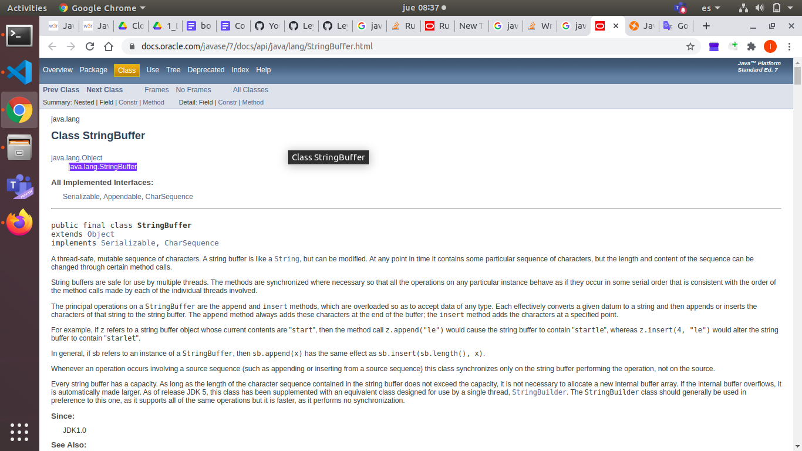

# java tutorial

## exercises

### from 1 - ?

https://www.w3resource.com/java-exercises/basic/index.php

#### exercise 0

Something important I would like to point out with this exercise is the use of javac and dockerfile. Usually when java is taught in universities, IDE are used but when you really want to learn something you should not use tools that make it easy for you, at least not while you are learning. The other important aspect of this and next exercises is the pressence of docker. Docker has several great feature like the portability and the better use of resources like memory or cpu.In this occasion the feature that matter the most to us is the fact that you can use any programming language or multi server design that you want making it easier to get started (apart that if you are like me, the least things that you need to install the better).

#### 1-1_w3resource_basic_5

To execute this command, use docker run -i -t IMAGENAME.

#### 1-1_w3resource_basic_15

This is a really interesting one, first of all , how could you know the way to execute a bash command from java ? stack overflow is my passion. The next question is, how could you know which packect to import to use StringBuffer, the answer, just google it, the first link will show the package required in this case java.lang.StringBuffer.

#### 1-1_w3resource_basic_78

Solution to exercise number 78 in the website is wrong, adding my fix in the folder with the folder "exercises"

#### 1-2_w3resource_basic_154

Great reminder that a boolean can appear in many forms, the result of function, the an expression evaluation or a position in an array or variable

#### 1-2_w3resource_basic_155

To resolve this problem you will need to a whiteboard explanation of the algorithm so you have a clear vision of what the code should so.

#### 1-2_w3resource_basic_165

Now I am wondering if only sorting the array wouldn't do the trick, like the code for the exercise 159.

#### 1-2_w3resource_basic_170

This is a great example of one of those moments where you shouls ask your interviewer if any of the number can appears several times in the sequence like iun this exersice

#### 1-2_w3resource_basic_171

Another great opportunity where we should ask for clarification. should it be an exact match or should we do some preprocessing like lowercase both sentence and remove sequential whitespaces ??????

#### 1-2_w3resource_basic_173

Interesting problem but the current version (the one in thw website) have some bugs

#### 1-2_w3resource_basic_175

Dear diary, today I learned how to solve multi files exercises https://www.studytonight.com/java/package-in-java.php

#### 1-2_w3resource_basic_178

This would be one type of multi class exercise where both classes are in the same file.

#### 1-2_w3resource_basic_178

This one and the exercise number 179 would be nice to analize the most optimal solution the brute force implementation is not so cool.

#### 1-2_w3resource_basic_178

Really thought the solution would be recursive, but it wasn't, always start with a brute force implementation.

#### 1-2_w3resource_basic_182

Something passing throug my head right now, if this is recursive and one of the branches it took are not identical the other continue executing ????.