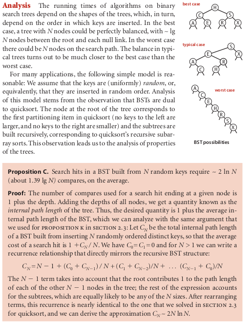

# Binary Search Tree

### the algorithm Binary Search Tree

### How it operate ?????

In this section, we will examine a symbol-table implementation that combines the
flexibility of insertion in a linked list with the efficiency of search in an ordered array.
Specifically, using two links per node (instead of the one link per node found in linked
lists) leads to an efficient symbol-table implementation based on the binary search tree
data structure, which qualifies as one of the most fundamental algorithms in computer science.

To begin, we define basic terminology. We are working with data
structures made up of nodes that contain links that are either null
or references to other nodes. In a binary tree, we have the restriction that every 
node is pointed to by just one other node, which is called its parent (except for one node, 
the root, which has no nodes pointing to it), and that each node has exactly two links, which are

called its left and right links, that point to nodes called its left child
and right child, respectively. Although links point to nodes, we can
view each link as pointing to a binary tree, the tree whose root is the referenced node.
Thus, we can define a binary tree as a either a null link or a node with a left link and
a right link, each references to (disjoint) subtrees that are themselves binary trees. In a
binary search tree, each node also has a key and a value, with an ordering restriction to
support efficient search.
Definition. A binary search tree (BST) is a binary tree where each node has a
Comparable key (and an associated value) and satisfies the restriction that the key
in any node is larger than the keys in all nodes in that node’s left subtree and small-
er than the keys in all nodes in that node’s right subtree.

We draw BSTs with keys in the nodes and use terminology
such as “ A is the left child of E ” that associates nodes with keys.
Lines connecting the nodes represent links, and we give the
value associated with a key in black, beside the nodes (sup-
pressing the value as dictated by context). Each node’s links
connect it to nodes below it on the page, except for null links,
which are short segments at the bottom. As usual, our exam-
ples use the single-letter keys that are generated by our index-
ing test client.

Basic implementation Algorithm 3.3 defines the BST data structure that we
use throughout this section to implement the ordered symbol-table API. We begin by
considering this classic data structure definition and the characteristic associated im-
plementations of the get() (search) and put() (insert) methods.
Representation. We define a private nested class to define nodes in BSTs, just as we
did for linked lists. Each node contains a key, a value, a left link, a right link, and a node
count (when relevant, we include node counts in red above the node
in our drawings). The left link points to a BST for items with smaller
keys, and the right link points to a BST for items with larger keys.
The instance variable N gives the node count in the subtree rooted at 
the node. This field facilitates the implementation of various ordered
symbol-table operations, as you will see. The private size() method
in Algorithm 3.3 is implemented to assign the value 0 to null links,
so that we can maintain this field by making sure that the invariant

size(x) = size(x.left) + size(x.right) + 1

holds for every node x in the tree.
A BST represents a set of keys (and associated values), and there
are many different BSTs that represent the same set. If we project the
keys in a BST such that all keys in each node’s left subtree appear to
the left of the key in the node and all keys in each node’s right subtree
appear to the right of the key in the node, then we always get the keys
in sorted order. We take advantage of the flexibility inherent in having
many BSTs represent this sorted order to develop efficient algorithms
for building and using BSTs.

Search. As usual, when we search for a key in a symbol table, we have one of two
possible outcomes. If a node containing the key is in the table, we have a search hit, so
we return the associated value. Otherwise, we have a search miss (and return null ). A
recursive algorithm to search for a key in a BST follows immediately from the recursive
structure: if the tree is empty, we have a search miss; if the search key is equal to the key
at the root, we have a search hit. Otherwise, we search (recursively) in the appropriate
subtree, moving left if the search key is smaller, right if it is larger. The recursive get()
method on page 399 implements this algorithm directly. It takes a node (root of a subtree)
as first argument and a key as second argument, starting with the root of the tree and
the search key. The code maintains the invariant that no parts of the tree other than the
subtree rooted at the current node can have a node whose key is equal to the search key.
Just as the size of the interval in binary search shrinks by about half on each iteration,

the size of the subtree rooted at the current node when searching in a BST shrinks when
we go down the tree (by about half, ideally, but at least by one). The procedure stops
either when a node containing the search key is found (search hit) or when the current
subtree becomes empty (search miss). Starting at the top, the search procedure at each
node involves a recursive invocation for one of that node’s children, so the search de-
fines a path through the tree. For a search hit, the path terminates at the node contain-
ing the key. For a search miss, the path terminates at a null link.
Insert. The search code in Algorithm 3.3 is almost as simple as binary search; that
simplicity is an essential feature of BSTs. A more important essential feature of BSTs is
that insert is not much more difficult to implement than search. Indeed, a search for a
key not in the tree ends at a null link, and all that we need to do is replace that link with
a new node containing the key (see the diagram on the next page). The recursive put()
method in Algorithm 3.3 accomplishes this task using logic similar to that we used for
the recursive search: if the tree is empty, we return a new node containing the key and
value; if the search key is less than the key at the root, we set the left link to the result
of inserting the key into the left subtree; otherwise, we set the right link to the result of
inserting the key into the right subtree.

naaaaahhhh way too much text ...... just read it

### source

-- algoritms fourth edition 409