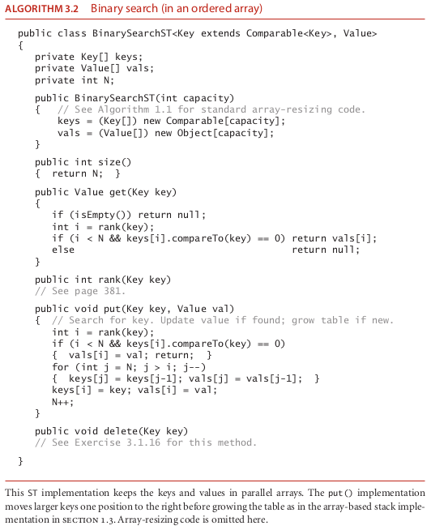
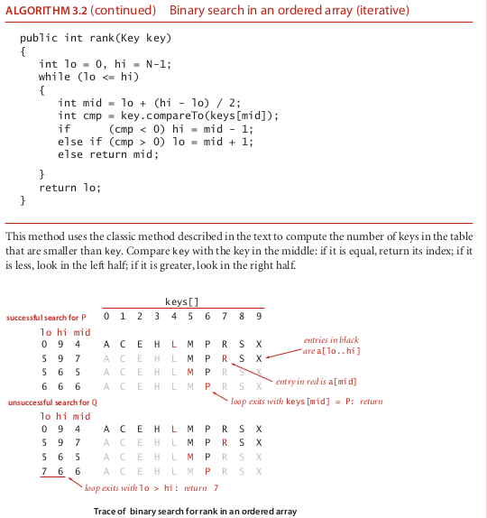
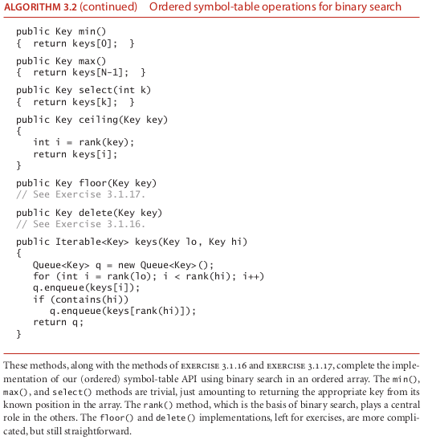
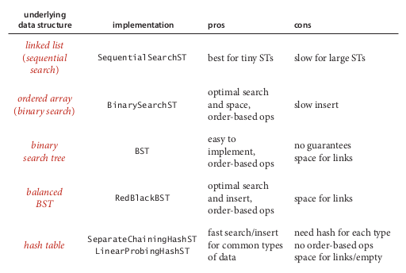

# binarySearch

### the algorithm binarySearch

Binary search in an ordered array Next, we consider a full implementation
of our ordered symbol-table API. The underlying data structure is a pair of parallel
arrays, one for the keys and one for the values. Algorithm 3.2 ( BinarySearchST ) on
the facing page keeps Comparable keys in order in the array, then uses array indexing
to enable fast implementation of get() and other operations.
The heart of the implementation is the rank() method, which returns the number
of keys smaller than a given key. For get() , the rank tells us precisely where the key is
to be found if it is in the table (and, if it is not there, that it is not in the table).
For put() , the rank tells us precisely where to update the value when the key is in the
table, and precisely where to put the key when the key is not in the table. We move all
larger keys over one position to make room (working from back to front) and insert the
given key and value into the proper positions in their respective arrays. Again, studying
BinarySearchST in conjunction with a trace of our test client is an instructive intro-
duction to this data structure.
This code maintains parallel arrays of keys and values (see Exercise 3.1.12 for an
alternative). As with our implementations of generic stacks and queues in Chapter 1,
this code carries the inconvenience of having to create a Key array of type Comparable
and a Value array of type Object , and to cast them back to Key[] and Value[] in the
constructor. As usual, we can use array resizing so that clients do not have to be con-
cerned with the size of the array (noting, as you shall see, that this method is too slow
to use with large arrays).

el put(), el deletemin() y el insert() tienen complejidad lineal,asi que por eso puede que necesitemos usar uno de los de aqui abajo

### source

-- algoritms fourth edition 391