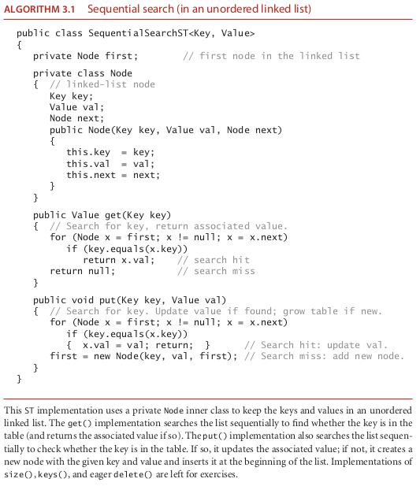

# sequentialSearch

### the algorithm sequentialSearch

### How it operate ?????

Sequential search in an unordered linked list One straightforward option
for the underlying data structure for a symbol table is a linked list of nodes that contain
keys and values, as in the code on the facing page. To implement get() , we scan through
the list, using equals() to compare the search key with the key in each node in the list.
If we find the match, we return the associated value; if not, we return null . To imple-
ment put() , we also scan through the list, using equals() to compare the client key
with the key in each node in the list. If we find the match, we update the value associ-
ated with that key to be the value given in the second argument; if not, we create a new
node with the given key and value and insert it at the beginning of the list. This method
is known as sequential search: we search by considering the keys in the table one after
another, using equals() to test for a match with our search key.
Algorithm 3.1 ( SequentialSearchST ) is an implementation of our basic symbol-
table API that uses standard list-processing mechanisms, which we have used for el-
ementary data structures in Chapter 1. We have left the implementations of size() ,
keys() , and eager delete() for exercises. You are encouraged to work these exercises
to cement your understanding of the linked-list data structure and the basic symbol-
table API.
Can this linked-list-based implementation handle applications that need large ta-
bles, such as our sample clients? As we have noted, analyzing symbol-table algorithms
is more complicated than analyzing sorting algorithms because of the difficulty of

characterizing the sequence of operations that might be invoked by a given client. As
noted for FrequencyCounter , the most common situation is that, while search and
insert patterns are unpredictable, they certainly are not random. For this reason, we pay
careful attention to worst-case performance. For economy, we use the term search hit to
refer to a successful search and search miss to refer to an unsuccessful search.
Proposition A. Search misses and insertions in an (unordered) linked-list sym-
bol table having N key-value pairs both require N compares, and search hits N
compares in the worst case. In particular, inserting N distinct keys into an initially
empty linked-list symbol table uses ~N 2 /2 compares.
Proof: When searching for a key that is not in the list, we test every key in the table
against the search key. Because of our policy of disallowing duplicate keys, we need
to do such a search before each insertion.
Corollary. Inserting N distinct keys into an initially empty linked-list symbol table
uses ~N 2 /2 compares.
It is true that searches for keys that are in the table need not take linear time. One useful
measure is to compute the total cost of searching for all of the keys in the table, divided
by N. This quantity is precisely the expected number of compares required for a search
under the condition that searches for each key in the table are equally likely. We refer to
such a search as a random search hit. Though client search patterns are not likely to be
random, they often are well-described by this model. It is easy to show that the average
number of compares for a random search hit is ~ N/2: the get() method in Algo-
rithm 3.1 uses 1 compare to find the first key, 2 compares to find the second key, and
so forth, for an average cost of (1 + 2 + ... + N )/ N = (N  1)/2 ~ N/2.
This analysis strongly indicates that a linked-list implementation with sequential
search is too slow for it to be used to solve huge problems such as our reference inputs
with clients like FrequencyCounter . The total number of compares is proportional to
the product of the number of searches and the number of inserts, which is more than
10 9 for Tale of Two Cities and more than 10 14 for the Leipzig Corpora.
As usual, to validate analytic results, we need to run experiments. As an example,
we study the operation of FrequencyCounter with command-line argument 8 for
tale.txt , which involves 14,350 put() operations (recall that every word in the input
leads to a put() , to update its frequency, and we ignore the cost of easily avoided calls

to contains() ). The symbol table grows to 5,737 keys, so about one-third of the opera-
tions increase the size of the table; the rest are searches. To visualize the performance, we
use VisualAccumulator (see page 95) to plot two points corresponding to each put()
operation as follows: for the i th put() operation we plot a gray point with x coordinate
i and y coordinate the number of key compares it uses and a red point with x coordi-
nate i and y coordinate the cumulative average number of key compares used for the
first i put() operations. As with any scientific data, there is a great deal of information
in this data for us to investigate (this plot has 14,350 gray points and 14,350 red points).
In this context, our primary interest is that the plot validates our hypothesis that about
half the list is accessed for the average put() operation. The actual total is slightly lower
than half, but this fact (and the precise shape of the curves) is perhaps best explained by
characteristics of the application, not our algorithms (see Exercise 3.1.36).
While detailed characterization of performance for particular clients can be com-
plicated, specific hypotheses are easy to formulate and to test for FrequencyCount
with our reference inputs or with randomly ordered inputs, using a client like the
DoublingTest client that we introduced in Chapter 1. We will reserve such testing
for exercises and for the more sophisticated implementations that follow . If you are not
already convinced that we need faster implementations, be sure to work these exercises
(or just run FrequencyCounter with SequentialSearchST on leipzig1M.txt !).

### source

-- algoritms fourth edition 387