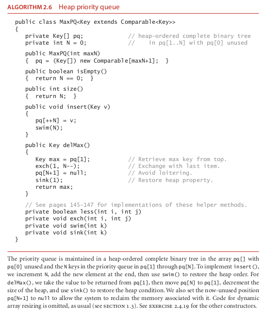
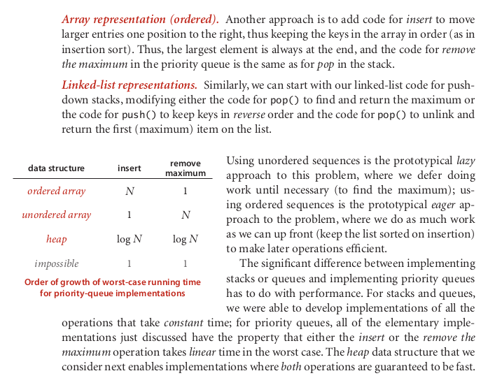
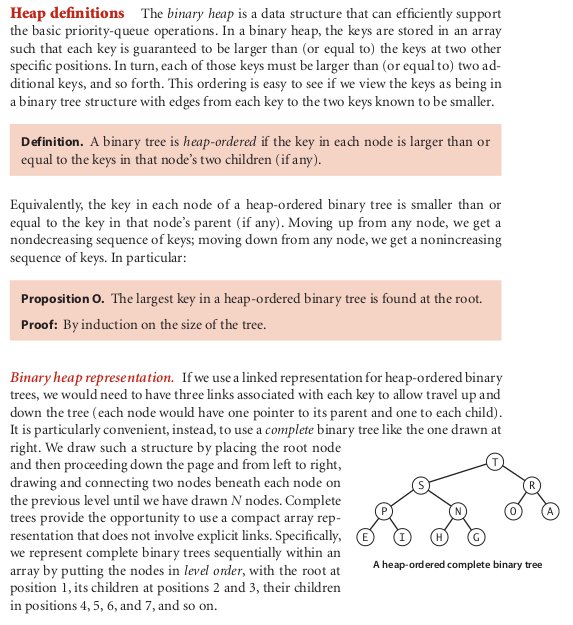

# priorityQueue

### priority queue implementation

### How it operate ?????

Many applications require that we process items having keys in order, but not nec-
essarily in full sorted order and not necessarily all at once. Often, we collect a set of
items, then process the one with the largest key, then perhaps collect more items, then
process the one with the current largest key, and so forth. For example, you are likely to
have a computer (or a cellphone) that is capable of running several applications at the
same time. This effect is typically achieved by assigning a priority to events associated
with applications, then always choosing to process next the highest-priority event. For
example, most cellphones are likely to process an incoming call with higher priority
than a game application.
An appropriate data type in such an environment supports two operations: remove
the maximum and insert. Such a data type is called a priority queue. Using priority
queues is similar to using queues (remove the oldest) and stacks (remove the newest),
but implementing them efficiently is more challenging.
In this section, after a short discussion of elementary representations where one or
both of the operations take linear time, we consider a classic priority-queue implemen-
tation based on the binary heap data structure, where items are kept in an array, subject
to certain ordering constraints that allow for efficient (logarithmic-time) implementa-
tions of remove the maximum and insert.
Some important applications of priority queues include simulation systems, where
the keys correspond to event times, to be processed in chronological order; job schedul-
ing, where the keys correspond to priorities indicating which tasks are to be performed
first; and numerical computations, where the keys represent computational errors, in-
dicating in which order we should deal with them. We consider in Chapter 6 a detailed
case study showing the use of priority queues in a particle-collision simulation.
We can use any priority queue as the basis for a sorting algorithm by inserting a se-
quence of items, then successively removing the smallest to get them out, in order. An
important sorting algorithm known as heapsort also follows naturally from our heap-
based priority-queue implementations. Later on in this book, we shall see how to use
priority queues as building blocks for other algorithms. In Chapter 4, we shall see how
priority queues are an appropriate abstraction for implementing several fundamental
graph-searching algorithms; in Chapter 5, we shall develop a data-compression algo-
rithm using methods from this section. These are but a few examples of the important
role played by the priority queue as a tool in algorithm design.

A priority-queue client. To appreciate the::::::::::::::::value of the priority-queue abstraction, consider the following problem: You have a huge
input stream of N strings and associated integer values, and your task is to find the largest or smallest M integers (and associated strings)
in the input stream. You might imagine the stream to be financial transactions, where your interest is to find the big ones, or pesticide levels in an agricultural product, where
your interest is to find the small ones, or requests for service, or results from a scientific
experiment, or whatever. In some applications, the size of the input stream is so huge
that it is best to consider it to be unbounded. One way to address this problem would
be to sort the input stream and take the M largest keys from the result, but we have
just stipulated that the input stream is too large for that. Another approach would be
to compare each new key against the M largest seen so far, but that is also likely to be
prohibitively expensive unless M is small. With priority queues, we can solve the prob-
lem with the MinPQ client TopM on the next page provided that we can develop efficient
implementations of both insert() and delMin() . That is precisely our aim in this sec-
tion. For the huge values of N that are likely to be encountered in our modern compu-
tational infrastructure, these implementations can make the difference between being
able to address such a problem and not having the resources to do it at all.

Array representation (unordered):::::::::::::: Perhaps the simplest priority-queue implementa-
tion is based on our code for pushdown stacks in Section 2.1. The code for insert in the
priority queue is the same as for push in the stack. To implement remove the maximum,
we can add code like the inner loop of selection sort to exchange the maximum item
with the item at the end and then delete that one, as we did with pop() for stacks. As
with stacks, we can add resizing-array code to ensure that the data structure is always at
least one-quarter full and never overflows.

### honest note

THe heapSort part, I didn't study it fully, probably we'll need to come back later

