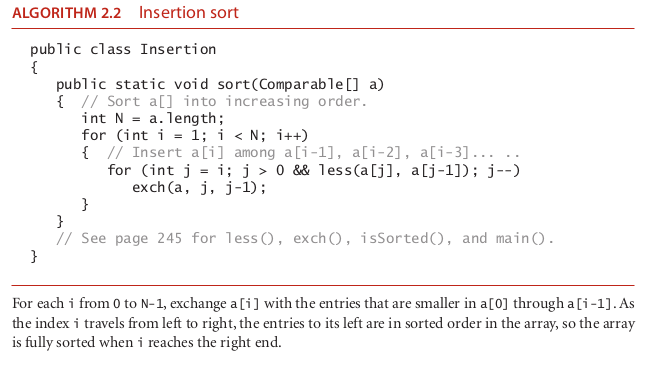

# insertion sort

### template sort class

### the algorithm insertion sort

### How it operate ?????

The algorithm that people often use to sort bridge hands is to con-
sider the cards one at a time, inserting each into its proper place among those already
considered (keeping them sorted). In a computer implementation, we need to make
space to insert the current item by moving larger items one position to the right, before
inserting the current item into the vacated position. Algorithm 2.2 is an implementa-
tion of this method, which is called insertion sort.
As in selection sort, the items to the left of the current index are in sorted order dur-
ing the sort, but they are not in their final position, as they may have to be moved to
make room for smaller items encountered later. The array is, however, fully sorted when
the index reaches the right end.
Unlike that of selection sort, the running time of insertion sort depends on the ini-
tial order of the items in the input. For example, if the array is large and its entries are
already in order (or nearly in order), then insertion sort is much, much faster than if
the entries are randomly ordered or in reverse order.

Insertion sort works well for certain types of nonrandom arrays that often arise in
practice, even if they are huge. For example, as just mentioned, consider what happens
when you use insertion sort on an array that is already sorted. Each item is immediately
determined to be in its proper place in the array, and the total running time is linear.
(The running time of selection sort is quadratic for such an array.) The same is true
for arrays whose keys are all equal (hence the condition in Proposition B that the keys
must be distinct).

More generally, we consider the concept of a partially sorted array, as follows: An in-
version is a pair of entries that are out of order in the array. For instance, E X A M P L E
has 11 inversions: E-A , X-A , X-M , X-P , X-L , X-E , M-L , M-E , P-L , P-E , and L-E . If the
number of inversions in an array is less than a constant multiple of the array size, we
say that the array is partially sorted. Typical examples of partially sorted arrays are the
following:
■ An array where each entry is not far from its final position
■ A small array appended to a large sorted array
■ An array with only a few entries that are not in place
Insertion sort is an efficient method for such arrays; selection sort is not. Indeed, when
the number of inversions is low, insertion sort is likely to be faster than any sorting
method that we consider in this chapter.
Proposition C. The number of exchanges used by insertion sort is equal to the
number of inversions in the array, and the number of compares is at least equal to
the number of inversions and at most equal to the number of inversions plus the
array size minus 1.
Proof: Every exchange involves two inverted adjacent entries and thus reduces the
number of inversions by one, and the array is sorted when the number of inver-
sions reaches zero. Every exchange corresponds to a compare, and an additional
compare might happen for each value of i from 1 to N-1 (when a[i] does not
reach the left end of the array).
It is not difficult to speed up insertion sort substantially, by shortening its inner loop to
move the larger entries to the right one position rather than doing full exchanges (thus
cutting the number of array accesses in half). We leave this improvement for an exercise
(see Exercise 2.1.25).
In summary, insertion sort is an excellent method for partially sorted arrays and is also
a fine method for tiny arrays. These facts are important not just because such arrays
frequently arise in practice, but also because both types of arrays arise in intermediate
stages of advanced sorting algorithms, so we will be considering insertion sort again in
relation to such algorithms.

N pow 2. worst case (randon array)

linear when we have a sorted array and we want to add a new entry

it is stable

### source

-- algoritms fourth edition 261

-- algoritms fourth edition 354
