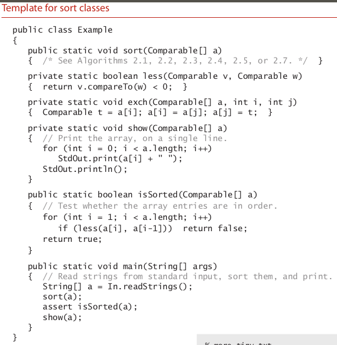
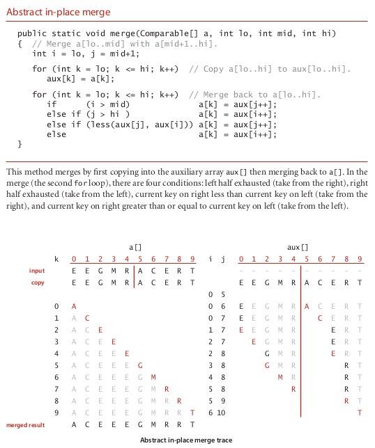
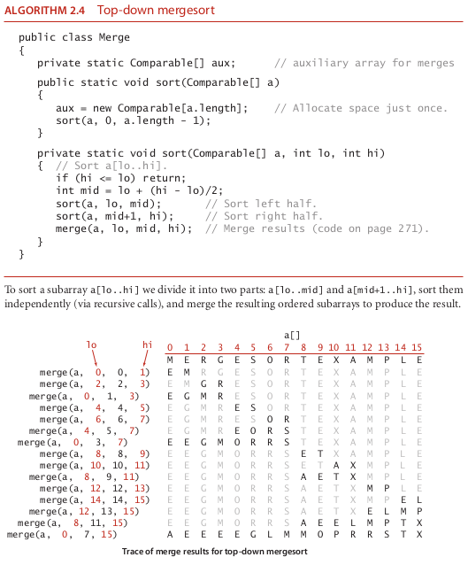
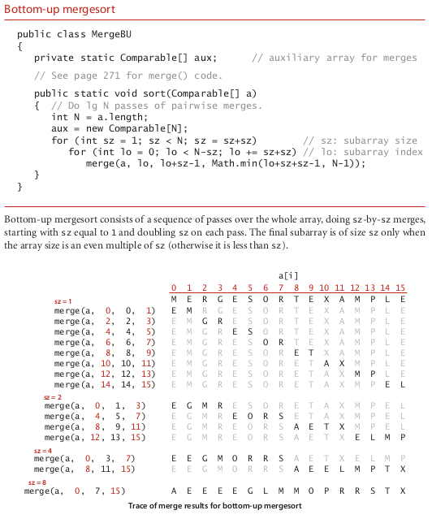

# mergesort

### template sort class

### the algorithm mergesort

### the algorithm top down mergesort

### the algorithm Bottom Up mergesort

### How it operate ?????

The algorithms that we consider in this section are based on a simple operation
known as merging : combining two ordered arrays to make one larger ordered array.
This operation immediately leads to a simple recursive sort method known as merge-
sort : to sort an array, divide it into two halves, sort the two halves (recursively), and
then merge the results. As you will see, one of mergesort’s most attractive properties is
that it guarantees to sort any array of N items in time proportional to N log N. Its prime
disadvantage is that it uses extra space proportional to N.

Abstract in-place merge :::::::: The straightforward approach to implementing merg-
ing is to design a method that merges two disjoint ordered arrays of Comparable ob-
jects into a third array. This strategy is easy to implement: create an output array of the
requisite size and then choose successively the smallest remaining item from the two
input arrays to be the next item added to the output array.
However, when we mergesort a large array, we are doing a huge number of merges,
so the cost of creating a new array to hold the output every time that we do a merge is
problematic. It would be much more desirable to have an in-place method so that we
could sort the first half of the array in place, then sort the second half of the array in
place, then do the merge of the two halves by moving the items around within the ar-
ray, without using a significant amount of other extra space. It is worthwhile to pause
momentarily to consider how you might do that. At first blush, this problem seems to
be one that must be simple to solve, but solutions that are known are quite complicated,
especially by comparison to alternatives that use extra space.
Still, the abstraction of an in-place merge is useful. Accordingly, we use the method
signature merge(a, lo, mid, hi) to specify a merge method that puts the result of
merging the subarrays a[lo..mid] with a[mid+1..hi] into a single ordered array,
leaving the result in a[lo..hi] . The code on the next page implements this merge
method in just a few lines by copying everything to an auxiliary array and then merging
back to the original. Another approach is described in Exercise 2.2.10.

Top-down mergesort
Algorithm 2.4 is a recur-
sive mergesort implementation based on this abstract in-
place merge. It is one of the best-known examples of the
utility of the divide-and-conquer paradigm for efficient
algorithm design. This recursive code is the basis for an
inductive proof that the algorithm sorts the array: if it
sorts the two subarrays, it sorts the whole array, by merg-
ing together the subarrays.
To understand mergesort, it is worthwhile to consider
carefully the dynamics of the method calls, shown in the
trace at right. To sort a[0..15] , the sort() method calls
itself to sort a[0..7] then calls itself to sort a[0..3]
and a[0..1] before finally doing the first merge of a[0]
with a[1] after calling itself to sort a[0] and then a[1]
(for brevity, we omit the calls for the base-case 1-entry
sorts in the trace). Then the next merge is a[2] with a[3]
and then a[0..1] with a[2..3] and so forth. From this
trace, we see that the sort code simply provides an orga-
nized way to sequence the calls to the merge() method.
This insight will be useful later in this section.
The recursive code also provides us with the basis for
analyzing mergesort’s running time. Because mergesort
is a prototype of the divide-and-conquer algorithm de-
sign paradigm, we will consider this analysis in detail.

Use insertion sort for small subarrays. ::::::::::::: We can improve most recursive algorithms by
handling small cases differently, because the recursion guarantees that the method will
be used often for small cases, so improvements in handling them lead to improvements
in the whole algorithm. In the case of sorting, we know that insertion sort (or selection
sort) is simple and therefore likely to be faster than mergesort for tiny subarrays. As
usual, a visual trace provides insight into the operation of mergesort. The visual trace
on the facing page shows the operation of a mergesort implementation with a cutoff
for small subarrays. Switching to insertion sort for small subarrays (length 15 or less,
say) will improve the running time of a typical mergesort implementation by 10 to 15
percent (see Exercise 2.2.23).
Test whether the array is already in order. ::::::::::::::: We can reduce the running time to be
linear for arrays that are already in order by adding a test to skip the call to merge() if
a[mid] is less than or equal to a[mid+1] . With this change, we still do all the recursive
calls, but the running time for any sorted subarray is linear (see Exercise 2.2.8).
Eliminate the copy to the auxiliary array. It is possible to eliminate the time (but not
the space) taken to copy to the auxiliary array used for merging. To do so, we use two
invocations of the sort method: one takes its input from the given array and puts the
sorted output in the auxiliary array; the other takes its input from the auxiliary array
and puts the sorted output in the given array. With this approach, in a bit of recursive
trickery, we can arrange the recursive calls such that the computation switches the roles
of the input array and the auxiliary array at each level (see Exercise 2.2.11).

 Bottom-up mergesort The recursive implementation of mergesort is prototypi-
cal of the divide-and-conquer algorithm design paradigm, where we solve a large prob-
lem by dividing it into pieces, solving the subproblems, then using the solutions for the
pieces to solve the whole problem. Even though we are thinking in terms of merging
together two large subarrays, the fact is that most merges are merging together tiny
subarrays. Another way to implement mergesort is to organize the merges so that we do
all the merges of tiny subarrays on one pass, then do a second pass to merge those sub-
arrays in pairs, and so forth, continuing until we do a merge that encompasses the whole array. This
method requires even less code than the standard recursive implementation. We start by doing a pass
of 1-by-1 merges (considering individual items as subarrays of size 1), then a pass of 2-by-2 merges
(merge subarrays of size 2 to make subarrays of size 4), then 4-by-4 merges, and so forth. The sec-
ond subarray may be smaller than the first in the 8 last merge on each pass (which is no problem for
merge() ), but otherwise all merges involve subarrays of equal size, doubling the sorted subarray size
for the next pass.

it is stable

### source

-- algoritms fourth edition 283

-- algoritms fourth edition 354