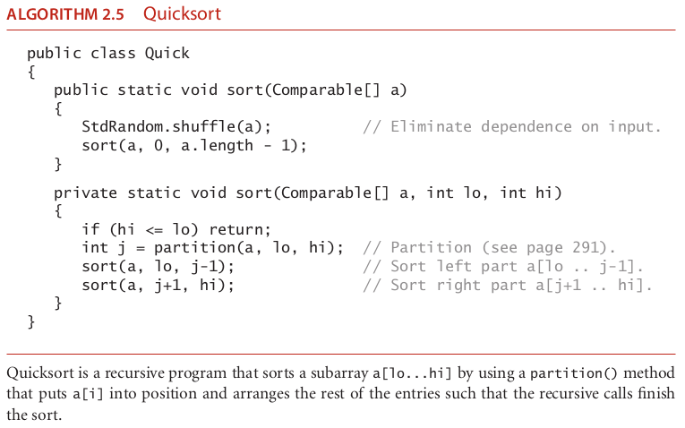
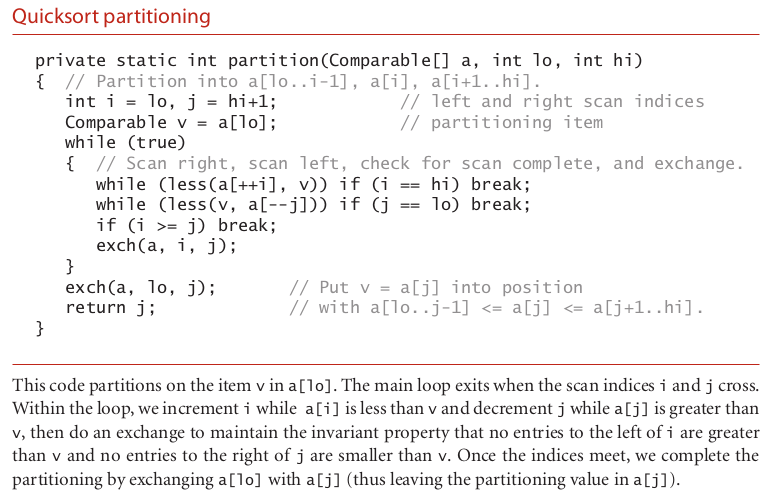

# quicksort

### template sort class

### the algorithm quicksort

### the algorithm partition quicksort

### How it operate ?????

The subject of this section is the sorting algorithm that is probably used more
widely than any other, quicksort. Quicksort is popular because it is not difficult to
implement, works well for a variety of different kinds of input data, and is substantially
faster than any other sorting method in typical applications. The quicksort algorithm’s
desirable features are that it is in-place (uses only a small auxiliary stack) and that
it requires time proportional to N log N on the average to sort an array of length N.
None of the algorithms that we have so far considered combine these two properties.
Furthermore, quicksort has a shorter inner loop than most other sorting algorithms,
which means that it is fast in practice as well as in theory. Its primary drawback is that
it is fragile in the sense that some care is involved in the implementation to be sure to
avoid bad performance. Numerous examples of mistakes leading to quadratic perfor-
mance in practice are documented in the literature. Fortunately, the lessons learned
from these mistakes have led to various improvements to the algorithm that make it of
even broader utility, as we shall see.

The basic algorithm
Quicksort is a divide-and-conquer method for sorting. It
works by partitioning an array into two subarrays, then sorting the subarrays indepen-
dently. Quicksort is complementary to mergesort: for mergesort, we break the array
into two subarrays to be sorted and then combine the ordered subarrays to make the
whole ordered array; for quicksort, we rearrange the array such that, when the two
subarrays are sorted, the whole array is ordered. In the first instance, we do the two
recursive calls before working on the whole array; in the second instance, we do the two
recursive calls after working on the whole array. For mergesort, the array is divided in
half; for quicksort, the position of the partition depends on the contents of the array.

### source

algoritms fourth edition 273, continue reading this section for the time complexity and some considerations like the h value to use
