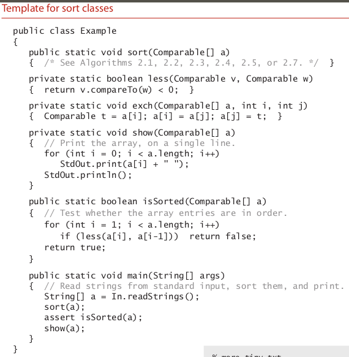
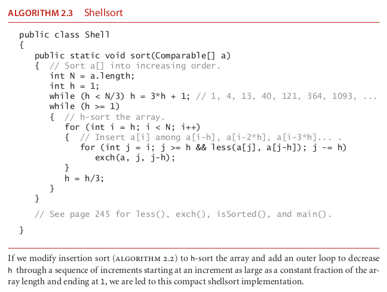

# shellsort

### template sort class

### the algorithm shellsort

### How it operate ?????

To exhibit the value of knowing properties of elementary sorts, we next
consider a fast algorithm based on insertion sort. Insertion sort is slow for large un-
ordered arrays because the only exchanges it does involve adjacent entries, so items
can move through the array only one place at a time. For example, if the item with the
smallest key happens to be at the end of the array, N1 exchanges are needed to get that
one item where it belongs. Shellsort is a simple extension of insertion sort that gains
speed by allowing exchanges of array entries that are far apart, to produce partially
sorted arrays that can be efficiently sorted, eventually by insertion sort.
The idea is to rearrange the array to give it the property that taking every hth entry
(starting anywhere) yields a sorted subsequence. Such an array is said to be h-sorted. Put
another way, an h-sorted array is h independent sorted subsequences, interleaved

together. By h-sorting for some large values of h, we can move items in the array
long distances and thus make it easier to h-sort for smaller values of h. Using such
a procedure for any sequence of values of  h that ends in 1 will produce a sorted ar-
ray: that is shellsort. The implementation
in Algorithm 2.3 on the facing page uses the sequence of decreasing values 1⁄2(3 k 1),
starting at the largest increment less than N/3 and decreasing to 1. We refer to such a
sequence as an increment sequence. Algorithm 2.3 computes its increment sequence;
another alternative is to store an increment sequence in an array.
One way to implement shellsort would be, for each h, to use insertion sort indepen-
dently on each of the h subsequences. Because the subsequences are independent, we
can use an even simpler approach: when h-sorting the array, we insert each item among
the previous items in its h-subsequence by exchanging it with those that have larger
keys (moving them each one position to the right in the subsequence). We accomplish
this task by using the insertion-sort code, but modified to decrement by h instead of 1
when moving through the array. This observation reduces the shellsort implementa-
tion to an insertion-sort-like pass through the array for each increment.
Shellsort gains efficiency by making a tradeoff between size and partial order in the
subsequences. At the beginning, the subsequences are short; later in the sort, the subse-
quences are partially sorted. In both cases, insertion sort is the method of choice. The
extent to which the subsequences are partially sorted is a variable factor that depends
strongly on the increment sequence. Understanding shellsort’s performance is a chal-
lenge. Indeed, Algorithm 2.3 is the only sorting method we consider whose perfor-
mance on randomly ordered arrays has not been precisely characterized.

N pow 2. worst case (randon array)

linear when we have a sorted array and we want to add a new entry

it is not stable

### source

-- algoritms fourth edition 273, continue reading this section for the time complexity and some considerations like the h value to use

-- algoritms fourth edition 354
