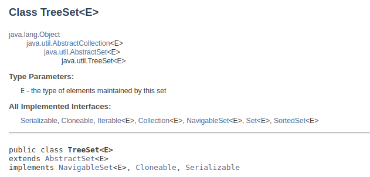

# treeSet

### the basic API

### what it implements and what inheritate

# interesting TreeSet from hfj N° 1, pag 534

Q:
I see there’s a LinkedList class, so wouldn’t that be better for
doing inserts somewhere in the middle? At least if I remember my Data
Structures class from college...

A:
Yes, good spot. The LinkedList can be quicker when you insert or
remove something from the middle, but for most applications, the difference
between middle inserts into a LinkedList and ArrayList is usually not enough
to care about unless you’re dealing with a huge number of elements. We’ll
look more at LinkedList in a few minutes.

# docs.oracle.com

A NavigableSet implementation based on a TreeMap. The elements are ordered using their natural ordering, or by a Comparator provided at set creation time, depending on which constructor is used.
This implementation provides guaranteed log(n) time cost for the basic operations (add, remove and contains).

Note that the ordering maintained by a set (whether or not an explicit comparator is provided) must be consistent with equals if it is to correctly implement the Set interface. (See Comparable or Comparator for a precise definition of consistent with equals.) This is so because the Set interface is defined in terms of the equals operation, but a TreeSet instance performs all element comparisons using its compareTo (or compare) method, so two elements that are deemed equal by this method are, from the standpoint of the set, equal. The behavior of a set is well-defined even if its ordering is inconsistent with equals; it just fails to obey the general contract of the Set interface.

Note that this implementation is not synchronized. If multiple threads access a tree set concurrently, and at least one of the threads modifies the set, it must be synchronized externally. This is typically accomplished by synchronizing on some object that naturally encapsulates the set. If no such object exists, the set should be "wrapped" using the Collections.synchronizedSortedSet method. This is best done at creation time, to prevent accidental unsynchronized access to the set:

   SortedSet s = Collections.synchronizedSortedSet(new TreeSet(...));
The iterators returned by this class's iterator method are fail-fast: if the set is modified at any time after the iterator is created, in any way except through the iterator's own remove method, the iterator will throw a ConcurrentModificationException. Thus, in the face of concurrent modification, the iterator fails quickly and cleanly, rather than risking arbitrary, non-deterministic behavior at an undetermined time in the future.

Note that the fail-fast behavior of an iterator cannot be guaranteed as it is, generally speaking, impossible to make any hard guarantees in the presence of unsynchronized concurrent modification. Fail-fast iterators throw ConcurrentModificationException on a best-effort basis. Therefore, it would be wrong to write a program that depended on this exception for its correctness: the fail-fast behavior of iterators should be used only to detect bugs.

