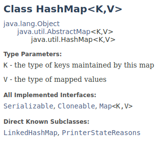

# the basic API

# what hashMap implements

# from source 1

Hash table based implementation of the Map interface. This implementation provides all of the optional map operations, and permits null values and the null key. (The HashMap class is roughly equivalent to Hashtable, except that it is unsynchronized and permits nulls.) This class makes no guarantees as to the order of the map; in particular, it does not guarantee that the order will remain constant over time.
This implementation provides constant-time performance for the basic operations (get and put), assuming the hash function disperses the elements properly among the buckets. Iteration over collection views requires time proportional to the "capacity" of the HashMap instance (the number of buckets) plus its size (the number of key-value mappings). Thus, it's very important not to set the initial capacity too high (or the load factor too low) if iteration performance is important.

An instance of HashMap has two parameters that affect its performance: initial capacity and load factor. The capacity is the number of buckets in the hash table, and the initial capacity is simply the capacity at the time the hash table is created. The load factor is a measure of how full the hash table is allowed to get before its capacity is automatically increased. When the number of entries in the hash table exceeds the product of the load factor and the current capacity, the hash table is rehashed (that is, internal data structures are rebuilt) so that the hash table has approximately twice the number of buckets.

As a general rule, the default load factor (.75) offers a good tradeoff between time and space costs. Higher values decrease the space overhead but increase the lookup cost (reflected in most of the operations of the HashMap class, including get and put). The expected number of entries in the map and its load factor should be taken into account when setting its initial capacity, so as to minimize the number of rehash operations. If the initial capacity is greater than the maximum number of entries divided by the load factor, no rehash operations will ever occur.

If many mappings are to be stored in a HashMap instance, creating it with a sufficiently large capacity will allow the mappings to be stored more efficiently than letting it perform automatic rehashing as needed to grow the table. Note that using many keys with the same hashCode() is a sure way to slow down performance of any hash table. To ameliorate impact, when keys are Comparable, this class may use comparison order among keys to help break ties.

Note that this implementation is not synchronized. If multiple threads access a hash map concurrently, and at least one of the threads modifies the map structurally, it must be synchronized externally. (A structural modification is any operation that adds or deletes one or more mappings; merely changing the value associated with a key that an instance already contains is not a structural modification.) This is typically accomplished by synchronizing on some object that naturally encapsulates the map. If no such object exists, the map should be "wrapped" using the Collections.synchronizedMap method. This is best done at creation time, to prevent accidental unsynchronized access to the map:

   Map m = Collections.synchronizedMap(new HashMap(...));
The iterators returned by all of this class's "collection view methods" are fail-fast: if the map is structurally modified at any time after the iterator is created, in any way except through the iterator's own remove method, the iterator will throw a ConcurrentModificationException. Thus, in the face of concurrent modification, the iterator fails quickly and cleanly, rather than risking arbitrary, non-deterministic behavior at an undetermined time in the future.

Note that the fail-fast behavior of an iterator cannot be guaranteed as it is, generally speaking, impossible to make any hard guarantees in the presence of unsynchronized concurrent modification. Fail-fast iterators throw ConcurrentModificationException on a best-effort basis. Therefore, it would be wrong to write a program that depended on this exception for its correctness: the fail-fast behavior of iterators should be used only to detect bugs.

# source 1

https://docs.oracle.com/en/java/javase/15/docs/api/java.base/java/util/HashMap.html

