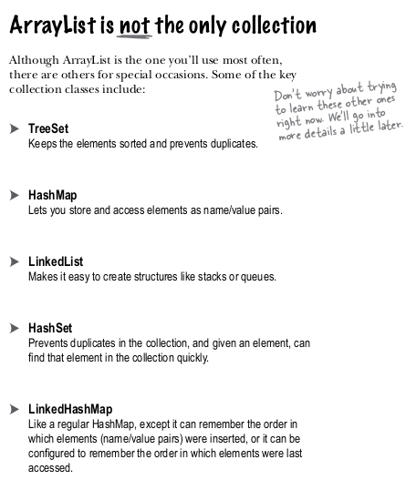
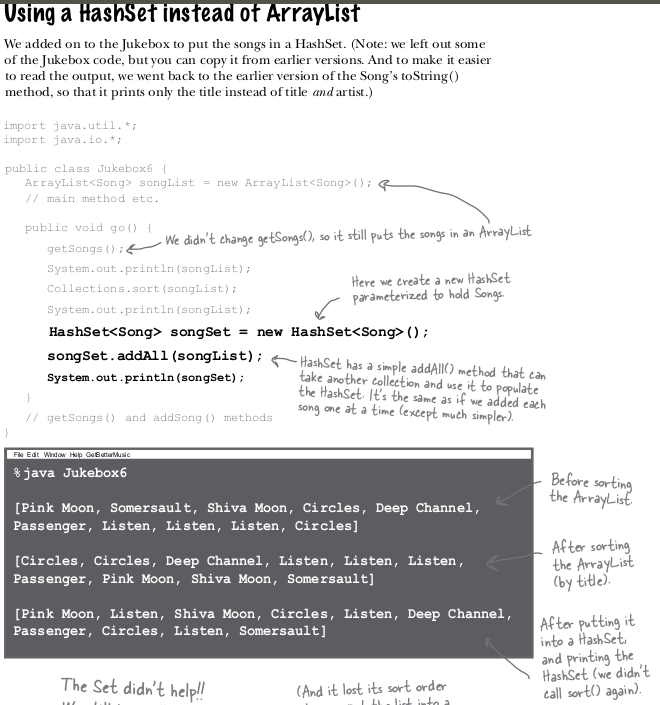
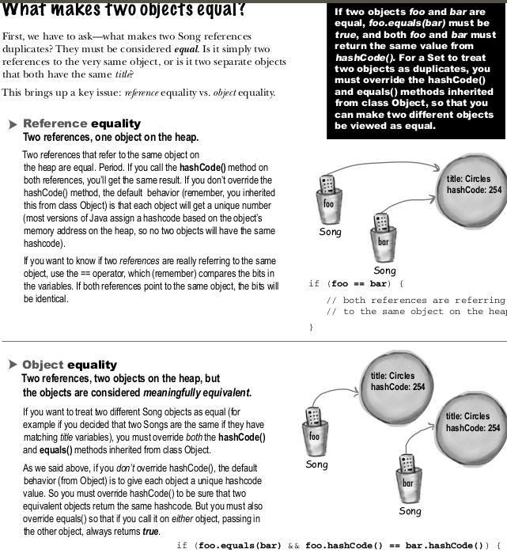
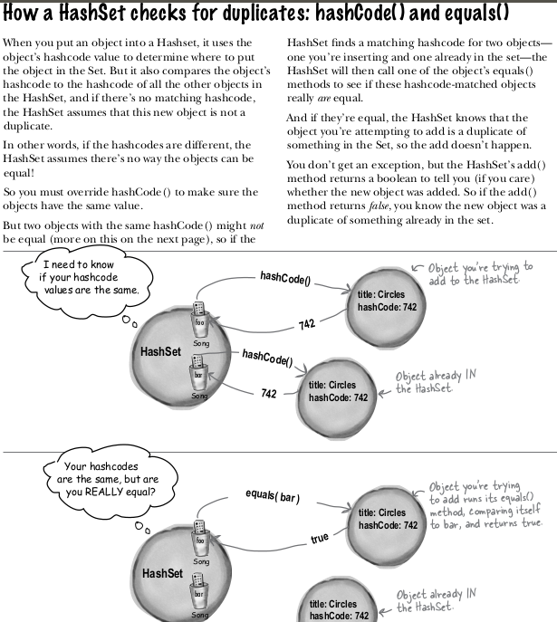
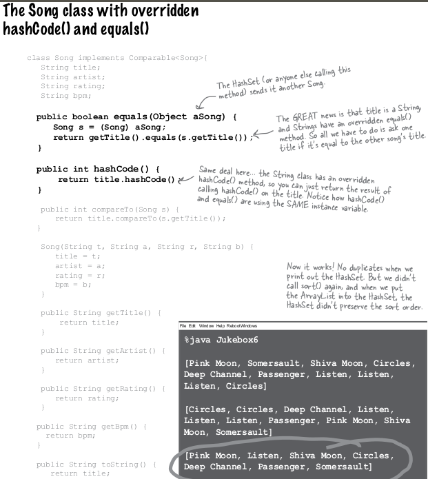

# the basic API

# what it implement and what it inheritance

This class implements the Set interface, backed by a hash table (actually a HashMap instance). It makes no guarantees as to the iteration order of the set; in particular, it does not guarantee that the order will remain constant over time. This class permits the null element.
This class offers constant time performance for the basic operations (add, remove, contains and size), assuming the hash function disperses the elements properly among the buckets. Iterating over this set requires time proportional to the sum of the HashSet instance's size (the number of elements) plus the "capacity" of the backing HashMap instance (the number of buckets). Thus, it's very important not to set the initial capacity too high (or the load factor too low) if iteration performance is important.

Note that this implementation is not synchronized. If multiple threads access a hash set concurrently, and at least one of the threads modifies the set, it must be synchronized externally. This is typically accomplished by synchronizing on some object that naturally encapsulates the set. If no such object exists, the set should be "wrapped" using the Collections.synchronizedSet method. This is best done at creation time, to prevent accidental unsynchronized access to the set:

   Set s = Collections.synchronizedSet(new HashSet(...));
The iterators returned by this class's iterator method are fail-fast: if the set is modified at any time after the iterator is created, in any way except through the iterator's own remove method, the Iterator throws a ConcurrentModificationException. Thus, in the face of concurrent modification, the iterator fails quickly and cleanly, rather than risking arbitrary, non-deterministic behavior at an undetermined time in the future.

Note that the fail-fast behavior of an iterator cannot be guaranteed as it is, generally speaking, impossible to make any hard guarantees in the presence of unsynchronized concurrent modification. Fail-fast iterators throw ConcurrentModificationException on a best-effort basis. Therefore, it would be wrong to write a program that depended on this exception for its correctness: the fail-fast behavior of iterators should be used only to detect bugs.

# interestingFacts

# source

https://docs.oracle.com/en/java/javase/15/docs/api/java.base/java/util/HashSet.html

# source 2

head first java page 598