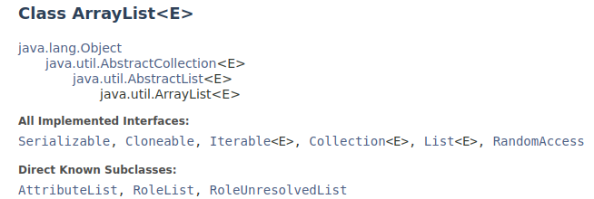

# ArrayList

### the basic API

Resizable-array implementation of the List interface. Implements all optional list operations, and permits all elements, including null. In addition to implementing the List interface, this class provides methods to manipulate the size of the array that is used internally to store the list. (This class is roughly equivalent to Vector, except that it is unsynchronized.)
The size, isEmpty, get, set, iterator, and listIterator operations run in constant time. The add operation runs in amortized constant time, that is, adding n elements requires O(n) time. All of the other operations run in linear time (roughly speaking). The constant factor is low compared to that for the LinkedList implementation.

Each ArrayList instance has a capacity. The capacity is the size of the array used to store the elements in the list. It is always at least as large as the list size. As elements are added to an ArrayList, its capacity grows automatically. The details of the growth policy are not specified beyond the fact that adding an element has constant amortized time cost.

An application can increase the capacity of an ArrayList instance before adding a large number of elements using the ensureCapacity operation. This may reduce the amount of incremental reallocation.

Note that this implementation is not synchronized. If multiple threads access an ArrayList instance concurrently, and at least one of the threads modifies the list structurally, it must be synchronized externally. (A structural modification is any operation that adds or deletes one or more elements, or explicitly resizes the backing array; merely setting the value of an element is not a structural modification.) This is typically accomplished by synchronizing on some object that naturally encapsulates the list. If no such object exists, the list should be "wrapped" using the Collections.synchronizedList method. This is best done at creation time, to prevent accidental unsynchronized access to the list:

   List list = Collections.synchronizedList(new ArrayList(...));
The iterators returned by this class's iterator and listIterator methods are fail-fast: if the list is structurally modified at any time after the iterator is created, in any way except through the iterator's own remove or add methods, the iterator will throw a ConcurrentModificationException. Thus, in the face of concurrent modification, the iterator fails quickly and cleanly, rather than risking arbitrary, non-deterministic behavior at an undetermined time in the future.

Note that the fail-fast behavior of an iterator cannot be guaranteed as it is, generally speaking, impossible to make any hard guarantees in the presence of unsynchronized concurrent modification. Fail-fast iterators throw ConcurrentModificationException on a best-effort basis. Therefore, it would be wrong to write a program that depended on this exception for its correctness: the fail-fast behavior of iterators should be used only to detect bugs.

# source

https://docs.oracle.com/javase/8/docs/api/java/util/ArrayList.html

head first java pag 131

