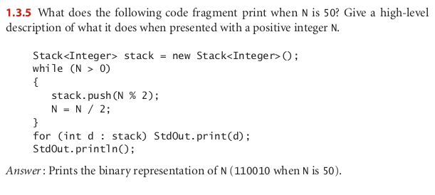

## 1.3.4

Write a stack client Parentheses that reads in a text stream from standard input
and uses a stack to determine whether its parentheses are properly balanced. For ex-
ample, your program should print true for [()]{}{`[ ( )( ) ]()} and false for [(]) .

## 1.3.5

## 1.3.7

Add a method peek() to Stack that returns the most recently inserted item on
the stack (without popping it).

## 1.3.9

https://github.com/devzer01/algorithms/blob/master/Algorithms/src/com/gems/algorithms/FixParen.java

## 1.3.10

Infix to posfix

https://leetcode.com/problems/basic-calculator/discuss/250315/infix-to-postfix-java-easy-solution-with-explanation

## 1.3.19

The real question here is how long will it take to find the last element, so if I have been inserting the elements and I had a last element instance variable it will be a constant time complexity operation, otherwise, it willbe a linear operation. This is a good oportunity to do a recusrsive function

## 1.3.15

