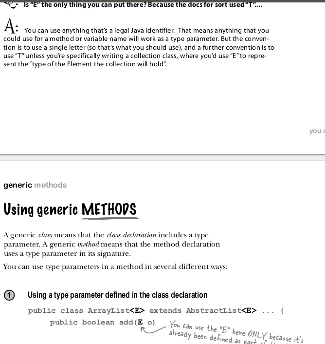

# 11_generics

## picture to have clarity of what are we talking about

Generics. An essential characteristic of collection ADTs is that we should be able to use
them for any type of data. A specific Java mechanism known as generics, also known
as parameterized types, enables this capability. The impact of generics on the program-
ming language is sufficiently deep that they are not found in many languages (including
early versions of Java), but our use of them in the present context involves just a small
bit of extra Java syntax and is easy to understand. The notation < Item > after the class
name in each of our APIs defines the name Item as a type parameter, a symbolic place-
holder for some concrete type to be used by the client. You can read Stack< Item>  as
“stack of items.” When implementing Stack , we do not know the concrete type of Item ,
but a client can use our stack for any type of data, including one defined long after we
develop our implementation.

### Source

algorithims by kevin wayne page 539 (real 573)

algoritms kevin wayne and the other guy with the name I can not pronounce fourth edition 

