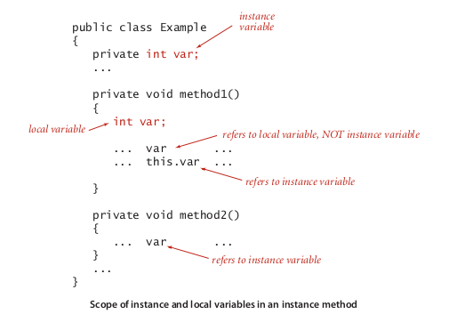

# When should you use static method

Scope. In summary, the Java code that we write to implement instance methods uses
three kinds of variables:
■ Parameter variables
■ Local variables
■ Instance variables
The first two of these are the same as for static methods: parameter variables are spec-
ified in the method signature and initialized with client values when the method is
called, and local variables are declared and initialized within the method body. The
scope of parameter variables is the entire method; the scope of local variables is the
following statements in the block where they are defined. Instance variables are com-
pletely different: they hold data-type values for objects in a class, and their scope is the
entire class (whenever there is an ambiguity, you can use the this prefix to identify in-
stance variables). Understanding the distinctions among these three kinds of variables
in instance methods is a key to success in object-oriented programming.

### img

### Source

Head first java page 275 (real 309)
